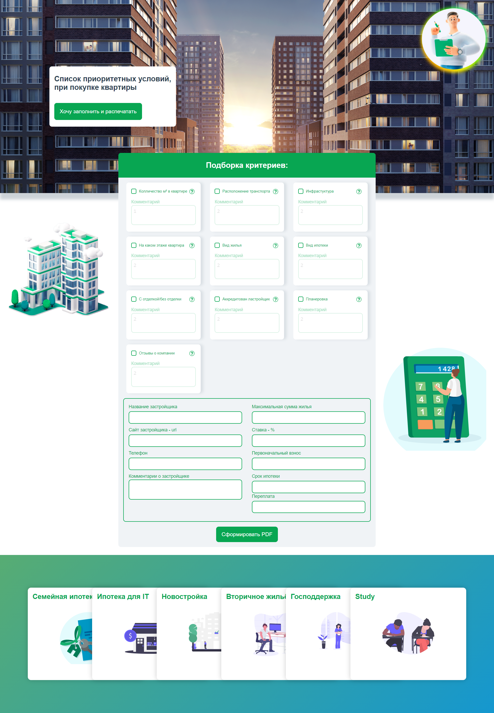

# Сервис по выбору критериев для покупки недвижимости 🏡🌳🏠🔥


## Варианты для решения проблемы с разделением цифр и связыванием с pinia-v-model
- пакет - https://www.npmjs.com/package/vue-number-format
- https://programmersought.com/article/168110867336/ статья
- https://medium.com/geekculture/emergency-pinia-course-7a80b8ed0b04 статья
- const numbers = 22222222  numbers.toLocaleString('ru-RU') result - '22 222 222'

## Можно добавить таблицу с данными на отдельную страницу
https://hc200ok.github.io/vue3-easy-data-table-doc/features/alternating.html

## Добавить компонент - пакет timeline путь от поиска квартиры до окончания
например типо такого - https://www.npmjs.com/package/vue-next-timeline

## Список критериев по приоритету
1. Вид жилья и Тип квартиры - (Новостройка / Дом / Вторичка ). Студия, Однокомнатная, Двухкомнатная, Апартаменты).
2. Сколько м² в недвижимости - Общая площадь, Жилая площадь, Площадь Кухни, Колличество комнат.
3. Транспорт - Автобус, Электричка, Метро, Автомобиль. Дистанция (кол-во минут) от недвижимости до транспорта.
4. Этаж - На каком этаже находится квартира. Первый и последний этаж не особо перспективный вариант.


5. Инфраструктура (Аптеки, Больницы, Детский Сад, Магазины, ДЕЗ, Парк) и описание
6. Экология (Недалеко кладбище, ТЭЦ, Проводные пути электричества) и описание
7. Планировки и описание
8. Кол-во комнат и тип квартиры (однушка, студия и т.д.) и описание
9. Отделка и описание
10. Год и месяц сдачи квартиры и описание
11. Акции и описание
12. Проверяем документы на квартиру и смотреть как оформлять сделку и описание
13. Поехать в этот район и посмотреть физически
14. Вид ипотеки
15. Перспективы
16. Банк
<br/>

Основная форма (может что-то добавить)
1. Название застройщика
2. Сайт застройщика - url
3. Телефон
4. Комментарий о застройщике
5. Максимальная сумма жилья
6. % ставка
7. Первоначальный взнос
8. Срок ипотеки
<br/>

## MVP
1. Валидация - light
2. Генерация PDF - прототип
3. Без адаптива
4. Базовая форма полей (посмотреть что нужно)
5. Базовые поля критериев (посмотреть что нужно)

### Список что нужно сделать
- изменить пакет vee-validate, для Vue v3 сейчас стоит 2
- Добавить пакет v-mask https://github.com/beholdr/maska
- Добавить валидацию для формы [VueValidate](https://vuelidate-next.netlify.app/#getting-started-1),
-- for Vue - 3, https://vee-validate.logaretm.com/v3 <br/>
  [VeeValidate](https://vee-validate.logaretm.com/v4/guide/composition-api/validation) 
- Нужно разобраться с props - деструкторизацией + ts
- Сделать конструктор и корректную вставку в PDF
- [Примеры дизайнов недвижимости](https://www.behance.net/search/projects/?search=%D0%BD%D0%B5%D0%B4%D0%B2%D0%B8%D0%B6%D0%B8%D0%BC%D0%BE%D1%81%D1%82%D1%8C%20landing&sort=recommended&time=month)
- проблема при скачать пдф, поля ресетятся а сам Файл пдф нет, временное решение перезагрузка страницы, либо попробовать через удаление объекта (new obj),а точней удаление через прототип
- сделать деплой ветку и ссылку

### Список что используется
- [jsPDF](http://raw.githack.com/MrRio/jsPDF/master/docs/index.html)
- [jsPDF Live Demo](http://raw.githack.com/MrRio/jsPDF/master/index.html)
- [Pinia](https://pinia.vuejs.org/)
- [TypeScript](https://www.typescriptlang.org/)
- [Vue 3](https://v3.ru.vuejs.org/ru/)

### Helpers по jsPDF

- Перенос текста
const splitTitle = doc.splitTextToSize(reportTitle, 180);
doc.text(15, 20, splitTitle);
- Добавить 2-й лист PDF doc.addPage("a4");
- Шрифт, жирный, италик, и т.д. под ru 
doc.setFont("PTSans", 'italic');
doc.setFontSize(10);
doc.text("А ну чики брики и в дамки!", 10, 10);
- Вставка картинки, в правый угол PDF
doc.addImage("examples/images/Octonyan.jpg", "JPEG", 165, 5, 40, 40);
- Цвет текста
doc.setTextColor(150);
doc.text("This is light gray.", 20, 30);
- Другие примеры - http://raw.githack.com/MrRio/jsPDF/master/index.html#

Черновой вариант - Preview


## Установка зависимостей
```
npm install
```

### Запуск проекта
```
npm run serve
```

### Сборка проекта для production
```
npm run build
```

### Запуск линтера и фикс файлов
```
npm run lint
```


